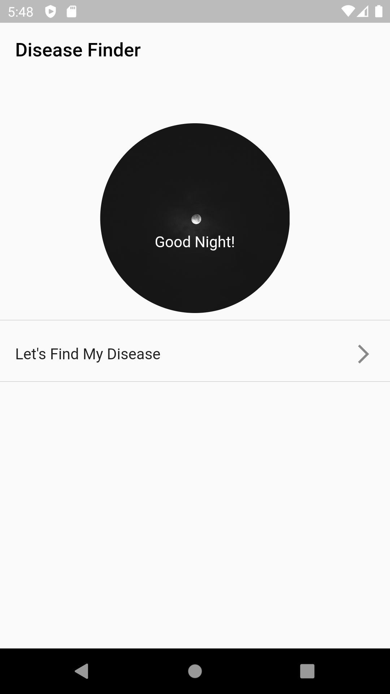

# Disease Finder

This is an app that finds your disease according to your symptoms. This app calculates the percentage of disease according to your symptoms and sorts diseases that can infecting you. You can select symptoms from lots of choices.  This app is 9th Grade Health and Traffic lesson project.

Important Note : This app is not a medical app. This application can estimate your infection based on your symptoms but  results can be false. 

Important Note : The information in this application has been researched and collected from different sources

# Photos From App

  
  
  
    

